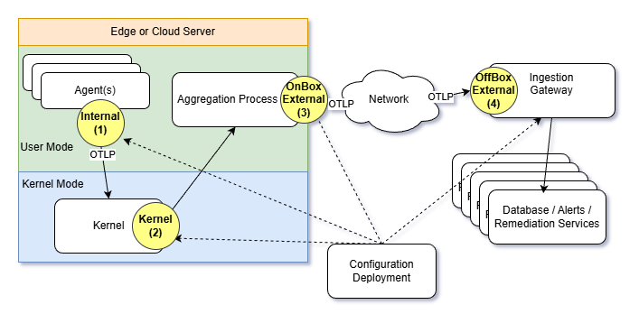

# Kernel Processor

The Kernel Processor operates within the kernel of a monitored machine,
providing a centralized point for collecting telemetry from all processes and
services running on that machine. Unlike user-mode Processors, it has the unique
capability to intercept, modify, or discard telemetry data before it ever leaves
the kernel. This means it can enforce telemetry policies or filter sensitive
information across the entire user-mode environment, ensuring consistent
handling of telemetry at the lowest level.

Among the four possible Processor locations, the Kernel Processor demands the
most careful consideration. Its elevated privileges and system-wide scope
introduce significant advantages, but if misapplied could also introduce
security and privacy implications. Deciding to use a kernel-mode Processor
should involve a  evaluation of your specific requirements, risks , and benefits,
as its impact extends to all user-mode activity on the machine.

1. **OTLP and gRPC remain relevant**: These protocols remain in use are used for
   communication between the Aggregation Process and the Ingestion Gateway.
2. **Ideal for systems and OS-level code**: Their lightweight nature makes them
   particularly suitable for integration with systems and OS code. For example,
   as an alterative to ETW's API's on Windows, or "rolling your own" in Linux.
3. **Seamless integration with OS functionality**: They enable direct
   connections to existing OS features, such as stack walking, advanced
   debugging facilities, and eBPF integration.

## Important Considerations

**A kernel-mode processor is not always advisable, or even permitted.** There
are several scenarios where kernel-mode operation may be inappropriate or
restricted.

## When Kernel-Mode Processing Is Appropriate

Despite the security considerations, there are specific scenarios where
kernel-mode processing provides compelling advantages that may justify its use:

### OpenTelemetry in Systems Code

Kernel-mode processing becomes particularly valuable when seeking to use
**OpenTelemetry in systems code**, such as with **C/C++** or **Rust**
applications. In these cases, many (if not all) of the OpenTelemetry niceties,
features, and capabilities can be brought to low-level systems code, enabling:

- Native integration with high-performance systems without the overhead of
  user-mode bridges
- Direct access to kernel-level telemetry sources that would otherwise be
  inaccessible
- Seamless telemetry collection from both user-mode and kernel-mode components
  in a unified OpenTelemetry framework

### High-Performance Logging Features

Kernel-mode operation enables access to very high-speed telemetry mechanisms:

- **Ultra-fast enablement/disablement of logging**: Leveraging capabilities
  found in both **ETW (Event Tracing for Windows)** and **user_events** for
  extreamly performant, in process, verbocity toggling
- **Reduced-copy telemetry collection**: Reduced copying of buffers, by
  utilizing unpagable kernel memory
- **Delivery of logging; even upon process crash**
- **Easier ablity to extract logging**, from kernel panics or system resets
- **High-frequency sampling**: Capabilities that would be prohibitively
  expensive in user-mode

### Advanced Diagnostic Actions

Kernel-mode processors can perform sophisticated diagnostic actions that are
impossible or severely limited in user-mode:

- **[Callstack walking](./Architecture.Action.CallstackWalk.document.md)**: Deep stack trace collection across process boundaries
  and privilege levels
- **[Memory dumps](./Architecture.Action.MemoryDump.document.md)**: Complete process or system memory snapshots with
  kernel-level access
- **[eBPF program integration](./Architecture.Probe.eBPF.document.md)**:
  Potentiall using **OpenTelemetry logs as inputs into eBPF, much like syscalls
  today
  programs** for real-time analysis and filtering
- **Cross-process telemetry correlation**: Unified view of telemetry across all
  processes on the system
- **Kernel-level event filtering and aggregation**: Dropping or modifying telemetry at the
  kernel level before it reaches user-mode processing.

These capabilities make kernel-mode processing particularly attractive for:

- High-performance systems monitoring
- Security event correlation and analysis
- Real-time system diagnostics
- Performance profiling of systems-level applications

### When Kernel-Mode Processing Should Be Avoided

- **Shared environments with untrusted neighbors**: In multi-tenant cloud
  environments, virtualized infrastructure, or shared hosting scenarios,
  kernel-mode access is often restricted or discouraged. Allowing kernel-level
  logging in these contexts can introduce security and privacy risks, especially
  if telemetry data from different tenants could be inadvertently combined or
  exposed.
- **High-security environments**: Organizations with strict security policies
  may prohibit kernel-mode components due to their elevated privileges.
- **Limited trust boundaries**: When the monitoring system itself operates in an
  environment where kernel access is not desired.

### Performance vs. Security vs. Capability Balance

There is a critical balance between **performance**, **security**, and
**capability** when considering kernel-mode processors:

- **Performance**: Kernel-mode operation can provide significant performance
  benefits through direct access to system resources and reduced context
  switching
- **Security**: Kernel-mode components have elevated privileges that, if
  compromised, could affect the entire system
- **Capability**: Kernel access enables unique telemetry collection and
  modification capabilities not available in user-mode

### Default Recommendation

**If in doubt, it's probably best not to use a kernel-mode processor.** The
elevated security risks and potential system stability implications may outweigh
the performance benefits unless there is a specific, compelling need for
kernel-level telemetry processing.

Consider user-mode alternatives first, and only escalate to kernel-mode
processing when:

- Specific telemetry requirements cannot be met in user-mode
- Performance requirements are critical and measurably improved by kernel access
- The security and operational risks have been thoroughly evaluated and accepted
- Appropriate security controls and monitoring are in place
